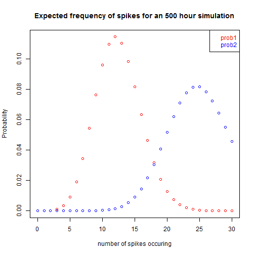

Probability Visualiser
========================================================
author: Anaru.b
date: 22 November 2015
transition: rotate
transition-speed: slow


For Process Change

Why use this App?
========================================================


This app assists with discussion around process change.
It is designed to promote understanding of statistical concepts by allowing participants to interact with

- Probabilities
- Batch Size
- Confidence intervals

And visualise the effect on the probability distribution caused by these changes.

[Really cool App](https://anarub.shinyapps.io/Trial1) 

Traditional mathmatical methods for decision making can be a bit like Witchcraft.
========================================================

Below is an equation that provides a sample size needed to assess if p really is 0.025. It has error terms, confidence interval and even zstars, what ever they are.

Who really understands this stuff?


```r
zstar=qnorm(.975);p=0.025;E=0.005
output<-round(zstar^2 * p *(1 - p)/E^2,-2)
```
All the CEO sees, is that you want to have a trial, involving around 3700 units at $100 each.

[This App will save your job!](https://anarub.shinyapps.io/Trial1) 


And thats why you need a Graph!
========================================================
left: 50%
 
***
While this graph is pretty cool, we're taking it one step further!

[But wait there's more!](https://anarub.shinyapps.io/Trial1) 

We got Widgets!
========================================================
left: 50%
The power of widgets is that they easily allow you to manuplate the parameters of your graph, there by improving understanding.

The below link will take you to this fabulous product. Please send no money now.

[Widgets this way!](https://anarub.shinyapps.io/Trial1) 
***


